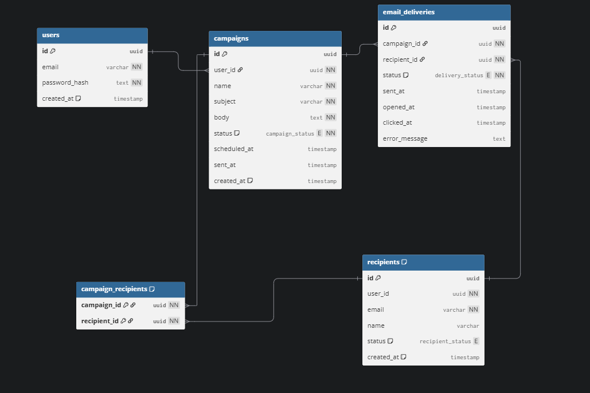

# Email Distribution System

This project is a full-stack app to send email campaigns and track delivery events.

It has:
- A backend API built with FastAPI
- A frontend dashboard built with React + Vite
- PostgreSQL for data
- Redis + Celery for background email delivery tasks

## What You Can Do

- Sign up and log in
- Create campaigns
- Upload recipients (CSV)
- Send campaign emails
- Track send/open/click status

## Project Structure

- `backend/`: FastAPI app, Celery worker, Alembic migrations, tests
- `frontend/`: React UI
- `docker-compose.yml`: local multi-service setup (db, redis, api, worker)

## Database ERD

The database schema includes users, campaigns, recipients, campaign-recipient mapping, and email deliveries.



## Tech Stack

- Backend: FastAPI, SQLAlchemy (async), Alembic, Celery, Redis
- Frontend: React 19, Vite, ESLint
- Database: PostgreSQL
- Testing: pytest, pytest-asyncio, httpx

## Quick Start (Docker)

1. Create a `.env` file in the project root from `.env.example`.
2. Run:

```bash
docker compose up --build
```

3. Open:
- API: `http://localhost:8000`
- API docs: `http://localhost:8000/docs`

## Local Setup (Without Docker)

### Backend

1. Use Python 3.13.
2. Create and activate virtual environment in `backend/.venv`.
3. Install dependencies:

```bash
cd backend
pip install ".[dev]"
```

4. Set environment variables (see `.env.example`).
5. Run migrations:

```bash
cd backend
alembic upgrade head
```

6. Start API:

```bash
cd backend
uvicorn main:app --reload
```

7. Start worker (new terminal):

```bash
cd backend
celery -A app.core.celery_app.celery_app worker --loglevel=info
```

### Frontend

```bash
cd frontend
npm ci
npm run dev
```

Frontend runs on Vite default URL (usually `http://localhost:5173`).

## Run Tests

```bash
cd backend
pytest -q
```

## CI

GitHub Actions workflow is configured in `.github/workflows/ci.yml`.
It runs:
- Backend tests
- Frontend lint
- Frontend build

## Notes For Beginners

- Start with Docker if this is your first time running the project.
- If login fails, check `SECRET_KEY` and database connection values.
- If email tasks are not running, make sure Redis and Celery worker are up.
